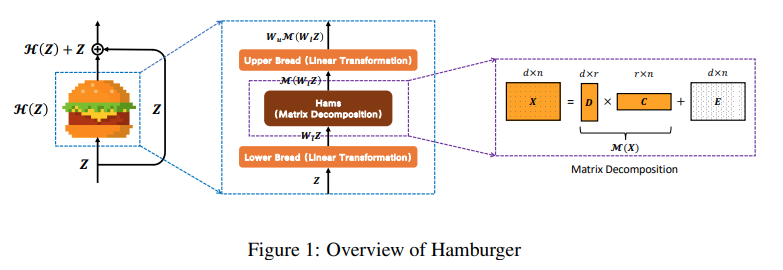

</img>

## Hamburger module - Pytorch

Pytorch implementation of the hamburger module from the ICLR 2020 paper <a href="https://openreview.net/forum?id=1FvkSpWosOl">Is Attention Better Than Matrix Decomposition</a>. Specifically, it will contain the NMF-MU (nonnegative matrix factorization w/ multiplicative update) module sandwiched by linear projections.

## Install

```bash
$ pip install hamburger-pytorch
```

## Usage

```python
import torch
from hamburger_pytorch import Hamburger

hamburger = Hamburger(
    dim = 512,       # input dimension
    n = 32 * 32,     # n will be size of the sequence, in this case, height times width of the images
    ratio = 8,       # matrix factorization ratio, recommended to be at 8
    K = 6            # number of iterations, optimal at 6 as shown in paper
)

x = torch.randn(1, 512, 32, 32)
hamburger(x) + x # (1, 512, 1024)
```

```
## Citations

```bibtex
@inproceedings{
    anonymous2021is,
    title={Is Attention Better Than Matrix Decomposition?},
    author={Anonymous},
    booktitle={Submitted to International Conference on Learning Representations},
    year={2021},
    url={https://openreview.net/forum?id=1FvkSpWosOl},
    note={under review}
}
```
